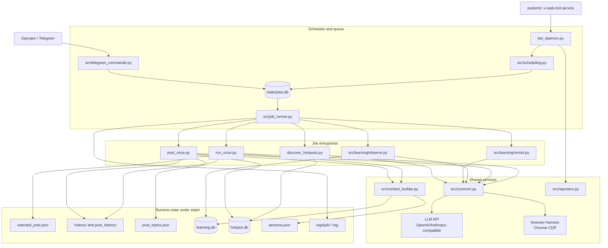
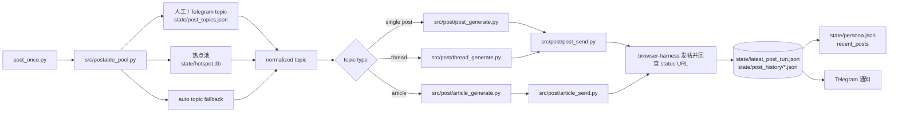
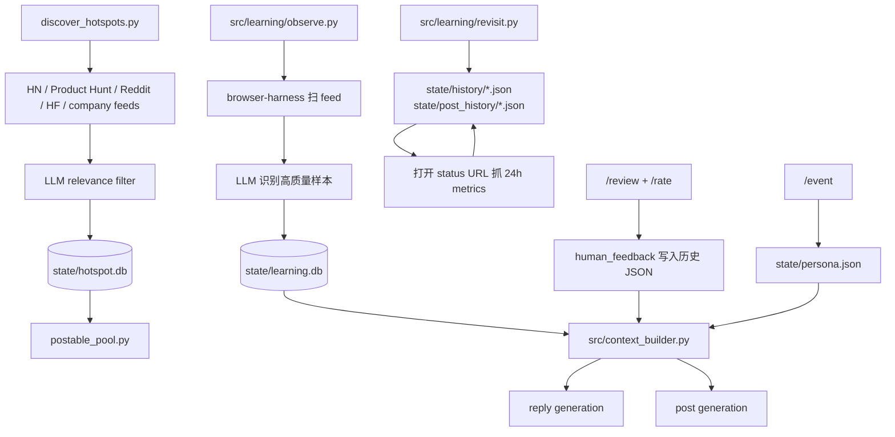

# X Reply Bot

中文 X/Twitter 账号自动运营机器人。它复用一份已经登录的 Chrome 会话，通过
`browser-harness` 和 CDP 操作 `x.com`，再调用 OpenAI-compatible 或
Anthropic-compatible 的 `/chat/completions` 接口做筛选、生成、复盘和学习。

当前项目已经不是单次回复脚本，而是一个带 systemd、持久化任务队列、Telegram
控制面、热点池、学习库、24h 回访和人设/反馈上下文的独立 Python bot。

## 当前状态

- 生产运行方式：`bot_daemon.py` 作为长驻 daemon，由 systemd 管理。
- 调度模型：所有计划任务和 Telegram 手动任务都会先进 `state/jobs.db`，再由
  `src/job_runner.py` 串行执行；同一时间只跑一个浏览器任务。
- 核心任务：
  - 回复/引用/转发：从 X 首页选帖、生成互动动作、通过浏览器发送。
  - 主动发帖：从人工 topic、热点池或自动 topic 生成单帖/thread/article。
  - 热点发现：从 HN、Product Hunt、Reddit、HuggingFace、公司动态等来源抓候选，
    经 LLM 过滤后写入 `state/hotspot.db`。
  - 观察学习：在空闲窗口看 feed，把高质量样本写入 `state/learning.db`。
  - 24h 回访：打开历史回复/发帖 URL，抓互动指标并写回历史记录。
- Telegram 能力：`/run`、`/status`、`/update`、`/config`、`/post_*`、
  `/learn_*`、`/revisit_*`、`/hotspot_*`、`/review`、`/rate`、`/event`。
- 上下文闭环：学习样本、人设事件、近期发帖和人工评分会进入后续回复/发帖 prompt。

## 架构图



## 数据流

### 1. 回复 / 引用 / 转发

```mermaid
flowchart LR
    start["run_once.py"] --> prepare["src/reply/prepare_post.py"]
    prepare --> scan["browser-harness 扫 x.com/home"]
    scan --> shortlist["本地过滤 + engagement 排序"]
    shortlist --> select_ai["LLM 选择一个可互动帖子"]
    select_ai --> selected[("state/selected_post.json")]
    selected --> generate["src/reply/generate_reply.py"]
    generate --> ctx["learning + persona + feedback context"]
    ctx --> reply_ai["LLM 决定 reply / quote / repost / like"]
    reply_ai --> guard["selection_id + source_post_url 一致性检查"]
    guard --> send["src/reply/send_reply.py"]
    send --> x["browser-harness 操作 X"]
    x --> history[("state/latest_run.json\nstate/history/*.json")]
    history --> tg_notify["Telegram 成功/失败通知"]
```



关键保护：`run_once.py` 会检查 `generate_reply.py` 返回的 `source_post_url` 和
`selection_id` 必须与 `state/selected_post.json` 一致，防止并发或旧状态导致回错帖。

### 2. 主动发帖



选题优先级是：人工队列 > 24h 热点池 > 自动 topic。热点被发出或被内容审稿永久拒绝后，
会在 `hotspot.db` 标记 `posted_at`，避免当天反复消耗 LLM。

### 3. 热点、学习、反馈闭环



## 运行方式

首次服务器部署见 [DEPLOY.md](DEPLOY.md)。最短生产路径：

```bash
cd /path/to/x-reply-bot
bash scripts/bootstrap_browser.sh
bash scripts/start_chrome.sh
# 在这份 Chrome profile 里手动登录 X 一次
sudo bash scripts/install_systemd.sh
bash scripts/start_bot.sh
```

常用运维命令：

```bash
bash scripts/status_bot.sh
bash scripts/stop_bot.sh
journalctl -u x-reply-bot.service -f
```

macOS 本地开发机通常不要安装 systemd daemon，直接跑单次入口。

## 单次入口

```bash
# 完整跑一轮回复/引用/转发
python3 run_once.py --trigger manual

# 拆开调试回复流程
python3 src/reply/prepare_post.py
python3 src/reply/generate_reply.py
python3 src/reply/send_reply.py --url "https://x.com/user/status/123" --reply "..."

# 主动发帖
python3 post_topics.py --add "很多 AI 产品最后输的不是模型，而是把用户折腾到不想再打开。"
python3 post_topics.py
python3 post_once.py --dry-run --trigger manual
python3 post_once.py --trigger manual

# 学习、回访、热点
python3 src/learning/observe.py --trigger manual
python3 src/learning/revisit.py --trigger manual
python3 discover_hotspots.py --trigger manual

# 同步 Telegram 命令菜单
python3 sync_tg_commands.py
```

cron 兼容入口还保留着，但生产优先用 systemd daemon：

```bash
bash scripts/scheduled_run.sh --no-jitter
bash scripts/install_cron.sh
bash scripts/uninstall_cron.sh
```

## 调度默认值

- 回复：每小时一次，北京时间 00:00 回访小时除外；`X_REPLY_JITTER_SECONDS`
  控制每小时内随机抖动，默认 1800 秒。
- 主动发帖：北京时间 `09,13,17,21`，每日上限默认 4；由
  `X_POST_SCHEDULE_HOURS`、`X_POST_JITTER_SECONDS`、`X_POST_DAILY_LIMIT` 控制。
- 学习：默认启用，每 900 秒尝试一次；若回复/发帖窗口太近会让路。
- 回访：每天北京时间 00:00，扫描发出至少 24h 的回复和主动帖。
- 热点发现：默认启用，每天北京时间 07:30；由 `X_HOTSPOT_ENABLED`、
  `X_HOTSPOT_SCHEDULE_TIME`、`X_HOTSPOT_GUARD_SECONDS` 控制。

所有 job 都带 `--trigger {schedule|manual|telegram}`，历史记录和 Telegram 状态会用它区分来源。

## 配置

`.env` 会被 `src.common.load_env_file()` 读取；systemd 和 shell 脚本也会加载同一份配置。

必填 LLM 配置：

```bash
X_REPLY_BASE_URL="https://..."
X_REPLY_API_KEY="..."
X_REPLY_MODEL="..."
```

兼容 fallback 名称：`OPENAI_BASE_URL`、`OPENAI_API_KEY`、`OPENAI_MODEL`，
以及 `ANTHROPIC_BASE_URL`、`ANTHROPIC_API_KEY`、`ANTHROPIC_MODEL`。

DashScope 注意事项：

```bash
X_REPLY_MODEL="qwen3.5-flash"
```

`qwen3.5-flash` 中间的点是官方模型名，写成 `qwen3.5flash` 会 404。

DeepSeek V4 Flash 示例：

```bash
X_REPLY_BASE_URL="https://api.deepseek.com"
X_REPLY_API_KEY="your DeepSeek key"
X_REPLY_MODEL="deepseek-v4-flash"
X_REPLY_DEEPSEEK_THINKING="disabled"
X_REPLY_DEEPSEEK_REASONING_EFFORT="high"
X_REPLY_USD_CNY_RATE="7.2"
```

浏览器与 Telegram：

```bash
X_REPLY_CDP_URL="http://127.0.0.1:9222"
BROWSER_HARNESS_BIN=".bin/browser-harness"
X_REPLY_TG_BOT_TOKEN="..."
X_REPLY_TG_CHAT_ID="..."
```

主动发帖配图是可选能力。配置 `X_REPLY_IMAGE_API_KEY` + `X_REPLY_IMAGE_API_URL`
可走 OpenAI-compatible 图片生成；配置 `GIPHY_API_KEY` 或 `UNSPLASH_ACCESS_KEY`
可作为搜索兜底。

## 状态文件

`state/` 是运行态核心目录：

- `state/jobs.db`：daemon 持久化任务队列。
- `state/logs/job-*.log`：每个队列任务的 stdout/stderr。
- `state/selected_post.json`：当前回复候选帖。
- `state/latest_run.json`、`state/history/*.json`：回复/引用/转发记录。
- `state/post_topics.json`：人工主动发帖 topic 队列。
- `state/latest_post_run.json`、`state/post_history/*.json`：主动发帖记录。
- `state/hotspot.db`、`state/latest_hotspot_run.json`、`state/hotspot_history/*.json`：
  热点候选池和发现记录。
- `state/learning.db`、`state/latest_learning_run.json`、`state/learning_history/*.json`：
  feed 学习样本和学习运行记录。
- `state/latest_revisit_run.json`、`state/revisit_history/*.json`：24h 回访记录。
- `state/persona.json`：账号静态人设、`/event` 事件、近期发帖样本。
- `state/telegram_state.json`：Telegram long-poll offset。

历史 JSON 里的时间字段统一使用 `time_beijing` 和 `date_beijing`。

## 易碎边界

- X DOM selector 是最容易坏的部分，集中在：
  - `src/reply/prepare_post.py`
  - `src/reply/send_reply.py`
  - `src/post/post_send.py`
  - `src/post/article_send.py`
  - `src/learning/observe.py`
  - `src/learning/revisit.py`
  - `src/hotspot/discover.py`
- 共用上传图片片段在 `src/harness.py::harness_upload_image_snippet`。
- 浏览器操作依赖 `browser-harness` 注入的 `goto`、`js`、`click`、`type_text`、
  `list_tabs`、`new_tab`、`switch_tab`、`wait_for_load` 等全局 helper。
- `run_once.py` 的 `selection_id` 一致性检查是防 stale state 的保护，不要删除。

## 本地验证

项目没有构建步骤。常用检查：

```bash
python3 -m pytest --rootdir . tests
python3 -m compileall bot_daemon.py run_once.py post_once.py src
```

如果从项目内部 worktree 跑 pytest，建议显式加 `--rootdir . tests`，避免父目录里的本地
pytest 配置或 vendored tests 干扰收集范围。
